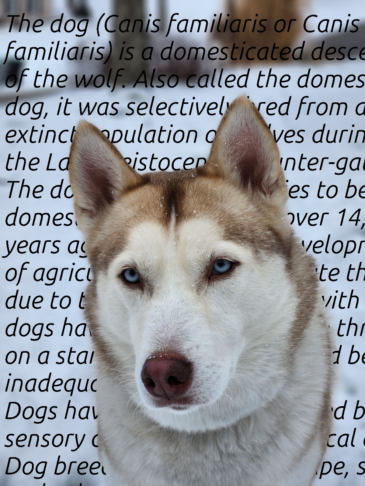

Tool for placing text behind the foreground of an image, inspired by [Text Behind Image](https://textbehindimage.rexanwong.xyz/), using [Segment Anything](https://github.com/facebookresearch/segment-anything).

Before             |  After
:-----------------:|:-------------------------:
 |  
